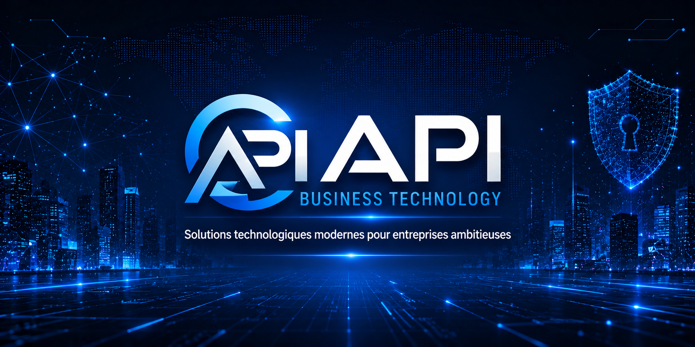
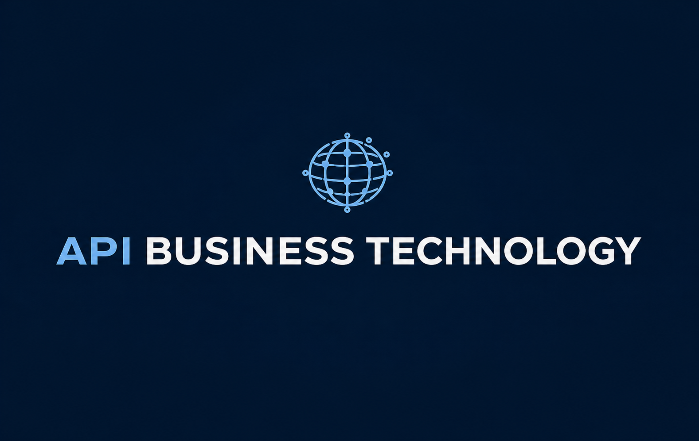

  

  

  <strong>API Business Technology</strong> 
  Solutions technologiques modernes pour entreprises ambitieuses

# Bonjour, je suis Pierre Richard Saint Louis 
Fondateur de **API Business Technology** | Développeur Logiciel | Spécialiste DevOps & Testing

---

## À propos de moi
Je suis un professionnel en **Programmation informatique (DEC)** avec une formation en **Finance (Baccalauréat)**.  
Je combine **ingénierie logicielle**, **DevOps**, **tests automatisés**, et **gestion de projet Agile** pour créer des solutions robustes et professionnelles.

Je suis le fondateur de **API Business Technology**, une entreprise dédiée à la création de plateformes technologiques modernes, dont **APISTOCK**, une solution professionnelle de gestion de stock.

---

## Compétences principales

### Développement & Architecture
- Node.js, Express  
- Next.js, React  
- Electron (applications desktop)  
- MongoDB  
- Python (amélioration continue)

### Tests & Qualité
- Jest (unit tests)  
- Supertest (integration tests)  
- Playwright (E2E tests)  
- Artillery (tests de charge)  
- Stryker (mutation testing)  
- SonarQube (analyse de qualité)

### DevOps & CI/CD
- GitLab CI/CD  
- Docker  
- Husky (pre-commit, pre-push)  
- Terraform, Ansible  
- Prometheus, Grafana  
- Git workflow avancé (branches, merge, rebase)

### Gestion de projet
- Agile / Scrum  
- Jira (EPICs, User Stories, Sprints)  
- Documentation technique PRO
- Marketing numerique

---

## Architecture globale

L’architecture API Business Technology repose sur 4 piliers:

### API Core Layer
- Services modulaires  
- Gestion des données  
- Sécurité intégrée  
- Validation & normalisation

### DevOps Automation Layer
- Pipelines CI/CD intelligents  
- Tests automatisés  
- Déploiements multi‑environnements  
- Observabilité complète

### AI & Security Layer
- Analyse comportementale  
- Détection d’anomalies  
- IA prédictive  
- Tableaux de bord en temps réel

### Frontend & Integration Layer
- Interfaces modernes  
- Intégrations B2B  
- Webhooks & micro‑services  
- Extensibilité pour partenaires

## API Business Technology
**API Business Technology** est une entreprise que j’ai fondée pour développer des solutions technologiques modernes et professionnelles.

### Produit phare :
### **APISTOCK — Plateforme Professionnelle de Gestion de Stock**
- Backend Node.js  
- Frontend Next.js  
- Application Desktop Electron  
- Pipeline CI/CD complet  
- Tests automatisés (unitaires, intégration, E2E, charge)  
- Documentation PRO  
- Architecture modulaire

---
### Objectif :
API Business Technology s’engage à développer des solutions technologiques modernes, 
fiables et évolutives. Notre approche repose sur l’ingénierie de qualité, l’automatisation 
intelligente, la sécurité avancée et la création de plateformes professionnelles capables 
de soutenir la croissance des entreprises.

## Projets en vedette
APISTOCK — Plateforme professionnelle de gestion de stock conçue pour les entreprises modernes. 
Architecture modulaire, automatisation avancée, intégration CI/CD, et fiabilité opérationnelle 
pour soutenir la croissance et la performance.

AI‑Security — Solution intelligente de surveillance et d’analyse comportementale. 
Détection d’incidents en temps réel, IA prédictive, tableaux de bord de sécurité, 
et infrastructure pensée pour les environnements critiques.

MinistryFlow DevOps — Système d’automatisation complet (CI/CD, IAS, tests, monitoring) destiné à optimiser la 
gestion opérationnelle des organisations et améliorer la productivité grâce à des pipelines robustes. 

---

## Pourquoi investir dans API Business Technology

### Technologie solide et moderne
Architecture modulaire, sécurisée, scalable, prête pour la production.

### Positionnement stratégique
Solutions DevOps, IA, sécurité — trois marchés en forte croissance.

### Automatisation avancée
Réduction des coûts, optimisation des opérations, fiabilité accrue.

### Vision long terme
Roadmap claire, évolutive, orientée innovation.

### Expertise technique forte
Fondée par un développeur & spécialiste DevOps expérimenté.

### Potentiel B2B élevé
Plateformes adaptées aux PME, startups, organisations gouvernementales.

## contacter :API Business Technology
- Email professionnel : apibusinesstechnology@gmail.com 
- API Business Technology : www.apibusinesstechnology.com
- LinkedIn : apibusinesstechnology

---

Merci d’avoir visité mon profil GitHub !

